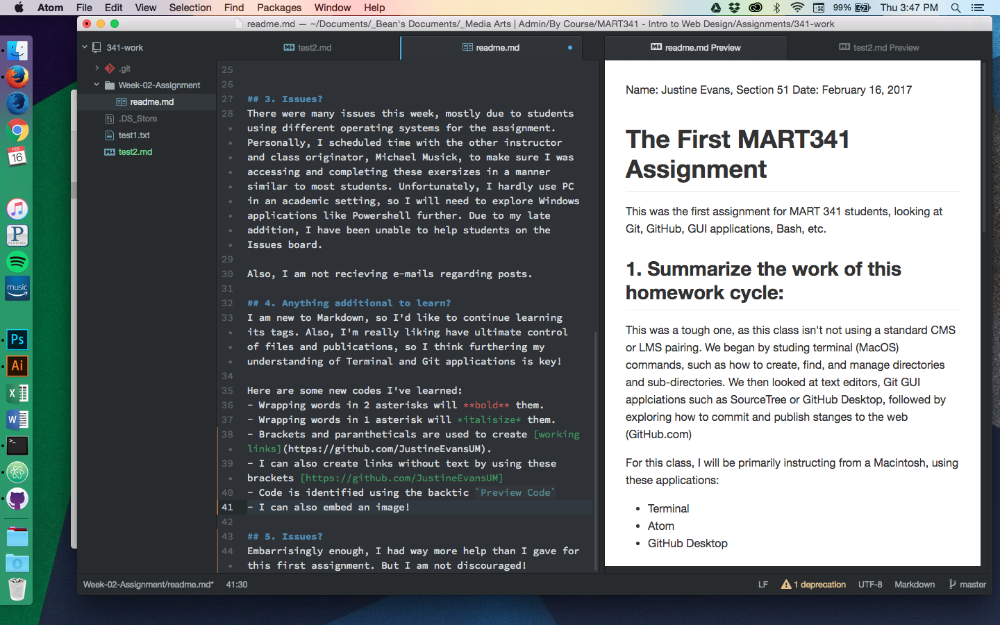

Name: Justine Evans, Section 51
Date: February 16, 2017

# The First MART341 Assignment
This was the first assignment for MART 341 students, looking at Git, GitHub, GUI applications, Bash, etc.

## 1. Summarize the work of this homework cycle:

This was a tough one, as this class isn't not using a standard CMS or LMS pairing. We began by studing terminal  (MacOS) commands, such as how to create, find, and manage directories and sub-directories. We then looked at text editors, Git GUI applciations such as SourceTree or GitHub Desktop, followed by exploring how to commit and publish stanges to the web (GitHub.com)

For this class, I will be primarily instructing from a Macintosh, using these applications:
- Terminal
- Atom
- GitHub Desktop

## 2. Steps taken to complete the assignment:
Students should have followed the following template when completing this secong assignment:
1. Create a set-up a GitHub account.
2. Go through all the materials for Week-02 of the website, including videos, readings, and the { TODO } sections.
3. Explore how to command their machines and communicate with their operating systems through interfaces like Powershell or Bash (PC) or Terminal (MacOS).
4. Create empty documents through the above applications.
5. Open and alter these documents in text editors, like TextEdit, NotePad, and Atom. Particularly Atom.
6. Use GitHub Desktop or SourceTree to track changes to these files and publish them to GitHub.

## 3. Issues?
There were many issues this week, mostly due to students using different operating systems for the assignment. Personally, I scheduled time with the other instructor and class originator, Michael Musick, to make sure I was accessing and completing these exersizes in a manner similar to most students. Unfortunately, I hardly use PC in an academic setting, so I will need to explore Windows applications like Powershell further. Due to my late addition, I have been unable to help students on the Issues board.

Also, I am not recieving e-mails regarding posts.

## 4. Anything additional to learn?
I am new to Markdown, so I'd like to continue learning its tags. Also, I'm really liking have ultimate control of files and publications, so I think furthering my understanding of Terminal and Git applications is key!

Here are some new codes I've learned:
- Wrapping words in 2 asterisks will **bold** them.
- Wrapping words in 1 asterisk will *italisize* them.
- Brackets and parantheticals are used to create [working links](https://github.com/JustineEvansUM).
- I can also create links without text by using these brackets [https://github.com/JustineEvansUM]
- Code is identified using the backtic `Preview Code`
- I can also embed an image!

## 5. Issues?
Embarrisingly enough, I had way more help than I gave for this first assignment. But I am not discouraged!!
